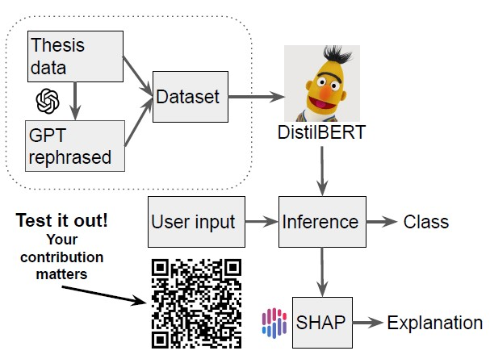

--- 
title: Detecting Artificial Thesis
authors: Aleksandr Makarov
editor: GPT-3.5 turbo
---

# 

Authors: 
Editor: 

## Introduction
The introduction of Chat-GPT has sparked a revolution in human efficiency. It has seamlessly integrated into our daily lives, becoming so commonplace that it is often taken for granted. However, the widespread use of Large Language Models (LLMs) as aids may also lead to instances of misuse. One particular area where this is evident is in the realm of academic papers, where traditional methods like review papers could soon become outdated.

### The people who are affected by AI generated text:

Users of AI-Generated Text:
* Individuals who rely on AI-generated text for various purposes, such as content creation, academic writing, or personal assistance.
* Businesses and organizations that utilize AI-generated text for customer service, marketing, or other communication purposes.

Content Creators and Writers:
* Professionals in the writing industry, such as journalists, authors, and copywriters, whose livelihoods may be impacted by the prevalence of AI-generated text.
* Academic researchers who may face challenges in distinguishing between AI-generated and human-authored content.

Publishing and Media Industry:
* Publishers and media outlets that may need to adapt their strategies to incorporate AI-generated text into their operations.
* Journalists and editors who may encounter issues related to credibility, ethics, and accuracy when dealing with AI-generated content.

Educational Institutions:
* Teachers and professors who need to navigate the implications of AI-generated text in terms of plagiarism detection and maintaining academic integrity.
* Students who may face difficulties in distinguishing between AI-generated and original content when conducting research.

Legal and Regulatory Authorities:
* Policymakers and lawmakers responsible for creating regulations and guidelines around the use of AI-generated text to ensure ethical and fair practices.
* Intellectual property lawyers who may need to address issues related to copyright and ownership of AI-generated content.

Society at Large:
* General users of online content who may unknowingly encounter AI-generated text without being able to differentiate it from human-authored content.
* Individuals who may be influenced or manipulated by AI-generated text in areas like politics, public opinion, or social media.

The stakes of the research question involve the potential consequences for the aforementioned stakeholders. Decisions made regarding the use of AI-generated text can have material implications for their livelihoods, economic interests, educational systems, legal frameworks, and the overall dynamics of communication and information dissemination. The power lies within the developers and providers of AI technologies, the regulatory bodies overseeing their use, and the individuals and organizations that rely on or are impacted by AI-generated text.

Nonetheless, many individuals, particularly Bachelor's students like myself, rely on these assistance tools for their academic work. I believe there is something in common in the psychosphere of my people from my curriculum and hence the way of human writing should not differ drastically among my and previous students. The main idea is to take data from previous theses before Chat-GPT and similar tools were  introduced to general public and compose a dataset of human written sentsences. Then they should be cut into 150 words chunks and sent to GPT-3.5 turbo via API key to be rephreased. The total cost ended up to be ~2$.

## The Data and What It Represents

The dataset contains 2472 rows with human written data and 2472 rows of GPT-3.5 turbo rephrased data. The steps and tools which took to create the dataset:
  1) The dspace theses registry of the University of Tartu was used https://dspace.ut.ee/handle/10062/63912 to obtain previous theses of my curriculum. The website parsing was performed using [selenium](https://pypi.org/project/selenium/) library. Out of 108 theses referenced there only 72 were in open access and hence downloaded. 
  2) Theses were then parsed using [PYPDF2](https://pypi.org/project/PyPDF2/) python library, which was a challenging task. Even though there are thesis guidlines and template presesnt for all of the students, they still altered heading style and size and thus made my work more complicated. At the end of the day I decided to take everything which starts after **Introduction** part and stop parsing after I encounter **References** or **Bibliography** part. This approach successfully parsed 54 works, while others had broken characters and required manual intervention and hence were termianted.
  3) After the text was obtained it was cut in 150 words chunks with overlap from different these. It was then sent to OpenAI GPT-3.5 turbo model using the API key. The exact prompt was: "Rephrase to avoid plagiarism: {{ 150 words chunk }}". 
  4) Following that, both human and GPT generated data were  stored in [hugginface dataest](https://huggingface.co/docs/datasets/index) and below the statistics on the distribution of the data for both human-written and GPT-generated data.

Figure 1. *Dataset distribution*

The resulting dataset is a relational format table in a form:
|Text|label|
|--|--|
|I go for a walk|orig|
|I conquered the world|gpt|
---

## The actual training part

Next the DistillBERT model was trained on that data. The model was also supplemented with SHAP explainability technique to get insights into the model's decision making. SHAP actually helped identify the major issue with the training dataset: there was not always dot present at the end of human written text, since I split it based on words, not sentences. SHAP showed that the model was mainly paed attention to the dot at the end of the sentence, and this issue was eleminated by correcting the datase. Also, the model was deployed in [huggingface spaces](https://randomcatlover-thesis-finetuned-classifier.hf.space) to be accessible to anyone as a demo. It also collects responses on "like" and "dislike" buttons and corresponding labels, to collect users' opinions about it. The demo was posted in the chat with coursemates, and at least 30 people followed the link. However, only 2 of them left feedback. For 1 person it worked, for another it didn't.

> The data preparation workflow and trainging are stored in this [repo](https://github.com/0rd0s1n1ster/gpt_text_detection)

Figure 2. *The worflow*

## Wrapping Up

The work resulted in a useful tool that can detect GPT-written text in Bachelor's work. However, despite all the effort a fundamental issue was identified: if the text is well written, sound and has correct grammar then it is most likely to be written by GPT, since Bachelor's work often lack clarity and elaborate grammar structutures. Nonetheless, since I am no expert in the field this tool was particulary useful for me and some of my coursemates, because it highlited the regions of model attention using SHAP explainability technique. SHAP comes with disadvantage in the curerntly deployed model in the demo, and this drawback is a slow speed, because the model is not running on GPU. It was also interesting to check that I am legally allowed to train my model on theses works, since they are published with CC NC ND 4.0 and there are no issues until I plan to raise some money based on the tool I developed. From emotional point this was exciting, since SHAP has highlighted potential issue with the dataset: it showed that at first model was paying most attention to the dots at the end of the sentences. Turned out human written part of the dataset not always had them, since I was cutting chunks based on the number of words and the model quickly learned it and exploited it. This points out how important are explainability techniques for a data journey, and how important to understand data based on model reasoning.

In the future dataset can be enhanced with more works to improve generalizing, since figure 3 indicates that there can be an overfit even after 2 epochs, while figure 4 indicates that accuracy was still growing so the chances of overfit are lower.

|||
|--|--|
|Figure 3. *Train val loss graph*| Figure 4. *Validation accuracy graph*
---
## P.S.
During this learning journey, I encountered struggles with punctuation in the dataset. However, these challenges were overcome by utilizing the SHAP explainability technique, which helped eliminate the issues caused by the dataset. The result was a useful tool capable of detecting GPT-written text in Bachelor's work.

A fundamental issue was identified in the process. It was found that if the text is well-written, coherent, and grammatically correct, it is more likely to be generated by GPT since Bachelor's work often lacks clarity and elaborate grammar structures. Despite this challenge, the tool proved to be valuable for the individual and their coursemates, as it highlighted the regions of model attention using the SHAP explainability technique.

From an emotional standpoint, the journey was exciting, especially when SHAP highlighted a potential issue with the dataset related to the model's attention to dots at the end of sentences. This discovery revealed that the human-written part of the dataset did not consistently include such punctuation, and the model quickly learned and exploited this pattern. This experience underscored the importance of explainability techniques in understanding data and model reasoning.

Overall, the learning journey provided valuable insights into the challenges, successes, and important considerations associated with working on a data project. It highlighted the significance of explainability techniques, dataset quality, legal aspects, and the potential for future improvements.