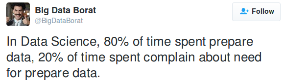

# Mirroring OCR Data: Looking at the number of Estonian Sailboats Across Different Year Categories
Authors: Siim Reinaas & [ChatGPT May 24 Version](https://help.openai.com/en/articles/6825453-chatgpt-release-notes)

## Introduction
Welcome to my blog post, where we delve into the world of OCR data and explore the dynamics of Estonian sailboat numbers across different year categories. [OCR](https://orc.org/), which stands for **O**ffshore **R**acing **C**ongress, is an organization that organises sailing regattas and develops racing rules. On their worldwide certificate database website (https://data.orc.org), valuable data about sailboats is available, allowing us to gain deeper insights into the development of sailing in Estonia.

Whether you're a sailing enthusiast or interested in statistics and racing events, this post is for you. In this blog post, we open the doors to the world of OCR data and examine how the number of Estonian sailboats has changed.

We analyze various year categories and delve into the depths of the data to discover trends in sailboat numbers. Are there noticeable growth or decline trends? Which year classes have been particularly successful for Estonian sailing, and which have posed more extraordinary challenges? We could also take a closer look at possible influences, such as technological development, changes in the design of sailboats and fluctuations in the popularity of competition classes. Still, I wonder if it fits into the time window.

Together, we explore the fascinating life cycle of Estonian sailboat numbers and uncover the factors that have influenced their evolution in different years. Have certain sailboat classes become more popular, or has the sailing culture undergone significant transformations? This post offers an exciting journey where we delve into OCR data analysis to understand better the dynamics of sailing in Estonia.

Let's dive into the world of data and discover how OCR data helps us understand and analyze the changing sailboat numbers in Estonia over different years. I'm confident this blog post will provide intriguing insights and fresh perspectives on the history of Estonian sailing!

## Data, Cleaning and Preprocessing

Accessing data from official sources can be surprisingly challenging, even when an organization has a website with the desired data. Often, these websites are filled with a wealth of information and options that can overwhelm novice users.

Firstly, finding the data can be a hurdle. Navigating organization websites can be complex, especially when there is no clear data access path. Sometimes, the required data may be buried deep within the website's structure or need advanced search functionalities to locate.

Additionally, data formatting can present an obstacle. Some official websites may provide data in formats that are not directly usable for analysis. For example, data may be stored in PDF files that make extracting text difficult or in unstructured formats that require additional processing.

Another challenge is data quality. While the data may be official, it can still contain errors, missing values, or inconsistencies. Before analysis, data cleaning is necessary, involving the identification and correction of erroneous data and the completion of missing values. This process can be time-consuming and requires knowledge of data preprocessing methods.

In short, the following obstacles are encountered with the data:
* Registration requirement (data not freely and publicly available)
* Complexity of website navigation (should ideally be clear and straightforward)
* Data formats such as HTML tables, which are suitable for web presentation, but additional formats like CSV or other widely used data formats would be beneficial
* Variable data structure (each year category should have consistent data fields rather than randomly changing)
* Fluctuating data quality.

It must be acknowledged that even when data is available on official organization websites, obtaining it can be difficult and require additional effort. Finding the data, getting it in a suitable format, and cleaning it all need specific skills and tools. However, overcoming these challenges can unlock valuable insights and a deeper understanding of the dynamics within the field of study.

### Data
Getting the information from the official data to make the calculations was time-consuming and sometimes frustrating. The raw data is now processed here to make it easier for future applicants. Below are the files in CVS format, organized and with a similar structure (I repeat - it took time to convert to this format, and they were not immediately available on the official website).

